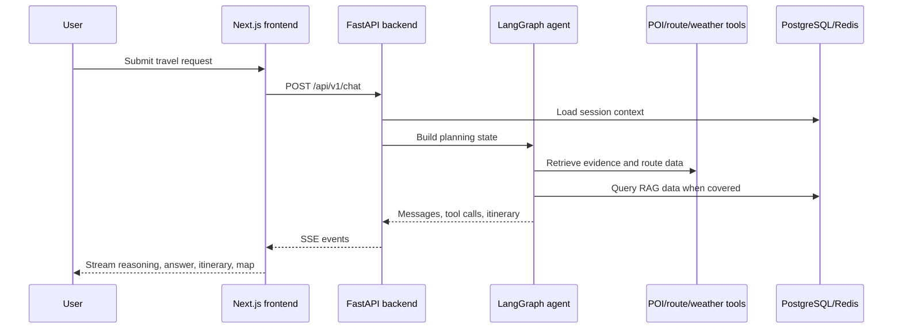

# Architecture

AI Trip Agent is a monorepo with a Next.js frontend and a FastAPI backend. The backend owns planning, external tool access, RAG retrieval, persistence, and streaming response formatting. The frontend owns the conversational workspace, itinerary presentation, local session index, map rendering, and export interactions.

## Runtime Flow

## Backend Modules

- `app/main.py`: FastAPI application lifecycle, CORS, router registration.
- `app/api/`: HTTP and SSE endpoints.
- `app/agent/`: intent extraction, prompts, graph orchestration, planning nodes, state models.
- `app/tools/`: RAG, POI, route, weather, and MCP adapter modules.
- `app/rag/`: embeddings, vector store access, and ingestion.
- `app/db/`: PostgreSQL connection setup.
- `app/services/`: Redis cache/session helpers and deterministic demo itinerary fallback.
- `tests/`: pytest coverage for API, agent, tools, RAG, and services.

## Frontend Modules

- `src/app/`: App Router pages for landing, chat, and itinerary detail.
- `src/components/chat/`: message list, input, streaming display, quick prompts.
- `src/components/itinerary/`: itinerary cards, day tabs, budget summary, export dialog, quality panel.
- `src/components/map/`: AMap container, POI markers, route lines, popups, day filter.
- `src/hooks/`: chat streaming, itinerary derived state, AMap loading.
- `src/lib/`: API client, SSE parser, itinerary validation, export helpers.
- `src/store/`: Zustand chat/session state.

## Data and State

- PostgreSQL stores RAG knowledge chunks and supports vector search through pgvector.
- Redis stores session context and rate-limit counters.
- Frontend local storage stores the session list for quick switching.
- The generated itinerary is returned as structured JSON and rendered by both the itinerary and map panels.
