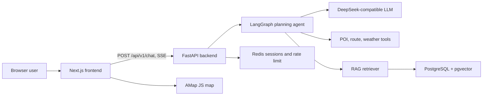

# AI Trip Agent

AI Trip Agent is a full-stack travel planning assistant. It turns natural-language travel requests into structured itineraries, streams the planning process to the browser, and visualizes generated stops and routes on an interactive map.

This repository is the cleaned engineering version of the project for portfolio and resume use. Graduation papers, defense slides, generated outputs, local dependencies, and private environment files are intentionally excluded.

## Features

- Conversational trip planning with Server-Sent Events streaming.
- LangGraph-based planning flow with intent extraction, clarification, tool execution, and itinerary generation.
- RAG support backed by PostgreSQL and pgvector for local city knowledge.
- POI, route, and weather tool adapters for evidence-aware itinerary generation.
- Redis-backed session history and per-session rate limiting.
- Next.js chat workspace with itinerary cards, budget summary, source quality checks, export actions, and map visualization.
- Docker Compose stack for frontend, backend, PostgreSQL, and Redis.

## Tech Stack

| Layer | Technologies |
| --- | --- |
| Frontend | Next.js 15, React 19, TypeScript, Tailwind CSS, Radix UI, Zustand, AMap JS API |
| Backend | FastAPI, LangGraph, LangChain Core, Pydantic Settings, SQLAlchemy, asyncpg |
| Data | PostgreSQL 16, pgvector, Redis 7, local JSON knowledge seed data |
| AI and tools | DeepSeek-compatible OpenAI API, sentence-transformers, POI/route/weather tool modules |
| Engineering | uv, pnpm, Ruff, mypy, pytest, Playwright, Docker Compose, GitHub Actions |

## Architecture



More detail is in [Docs/ARCHITECTURE.md](Docs/ARCHITECTURE.md).

## Documentation

- [Product requirements](Docs/PRODUCT_REQUIREMENTS.md)
- [Technical stack](Docs/TECH_STACK.md)
- [Architecture](Docs/ARCHITECTURE.md)
- [API reference](Docs/API.md)
- [Frontend design](Docs/FRONTEND_DESIGN.md)
- [Development guide](Docs/DEVELOPMENT.md)
- [Testing guide](Docs/TESTING.md)
- [Deployment notes](Docs/DEPLOYMENT.md)
- [Project summary](Docs/PROJECT_SUMMARY.md)

## Project Structure

```text
backend/            FastAPI service, agent graph, tools, RAG, tests
frontend/           Next.js app, UI components, hooks, E2E tests
Docs/               Engineering documentation
.github/workflows/  GitHub Actions CI
scripts/            Local startup helpers
docker-compose.yml  Local full-stack runtime
.env.example        Environment variable template, safe to commit
```

## Environment Variables

Copy the template before local development. Real keys must stay in ignored `.env` files.

```powershell
Copy-Item .env.example .env
Copy-Item .env.example backend/.env
Copy-Item .env.example frontend/.env.local
```

Important variables:

| Variable | Used by | Description |
| --- | --- | --- |
| `DEEPSEEK_API_KEY` | backend | LLM API key. Rotate it if it was ever committed or shared. |
| `DEEPSEEK_BASE_URL` | backend | OpenAI-compatible API endpoint. |
| `DEEPSEEK_MODEL` | backend | Chat model name. |
| `POSTGRES_*` | backend, Docker | PostgreSQL connection settings. |
| `POSTGRES_HOST_PORT` | Docker | Host port exposed by the PostgreSQL container. Defaults to `15432` to avoid common local conflicts. |
| `REDIS_HOST`, `REDIS_PORT` | backend, Docker | Redis connection settings. |
| `REDIS_HOST_PORT` | Docker | Host port exposed by the Redis container. Defaults to `16379` to avoid common local conflicts. |
| `AMAP_API_KEY` | backend | AMap REST API key for backend tools. |
| `NEXT_PUBLIC_AMAP_KEY` | frontend | AMap browser key. This value is public in the browser, so restrict it by domain in AMap. |
| `NEXT_PUBLIC_AMAP_SECRET` | frontend | AMap JS security code. Treat it as deploy-time config and restrict usage. |
| `NEXT_PUBLIC_USE_MOCK` | frontend | Use mock responses for frontend demos. |
| `DEMO_MODE` | backend | Enable deterministic demo fallback itinerary generation. |

## Local Development

Start infrastructure:

```powershell
docker compose up -d postgres redis
```

By default, Docker exposes PostgreSQL on `localhost:15432` and Redis on `localhost:16379`. The backend container still talks to `postgres:5432` and `redis:6379` inside the Compose network.

Start the backend:

```powershell
cd backend
uv sync
uv run uvicorn app.main:app --host 127.0.0.1 --port 8000 --reload
```

When running the backend outside Docker, use `POSTGRES_PORT=15432` and `REDIS_PORT=16379` if you use the Compose infrastructure defaults.

Start the frontend:

```powershell
cd frontend
corepack enable
corepack pnpm install --frozen-lockfile
corepack pnpm dev
```

Open [http://localhost:3000/chat](http://localhost:3000/chat).

On Windows, the helper script can start PostgreSQL, Redis, backend, and frontend:

```powershell
.\scripts\start-dev.ps1
```

The helper enables `http://127.0.0.1:10808` for network downloads by default while keeping `token-plan-cn.xiaomimimo.com` in `NO_PROXY` for direct LLM calls. Pass `-NoProxy` only when no proxy is needed.

## Docker

Run the full stack:

```powershell
docker compose up --build
```

Validate the compose file:

```powershell
docker compose config
```

Ingest local knowledge data after services are ready:

```powershell
docker compose exec backend uv run python -m app.rag.ingest
```

## Tests and Checks

Backend:

```powershell
cd backend
uv run ruff check app tests
uv run ruff format --check app tests
uv run mypy app --ignore-missing-imports
uv run pytest tests -q
```

Frontend:

```powershell
cd frontend
corepack pnpm lint
corepack pnpm typecheck
corepack pnpm build
corepack pnpm test:e2e
```

## Screenshots

The public repository currently keeps source assets only. Add current product screenshots under `Docs/images/` before publishing the GitHub README, for example:

- Landing page desktop screenshot.
- Chat planning workspace screenshot.
- Itinerary and map visualization screenshot.

## Roadmap

- Add production deployment profiles for frontend and backend.
- Add a small public screenshot set and demo GIF.
- Improve observability around agent tool calls and slow external APIs.
- Add stricter fixture-based tests for itinerary validation and map data.
- Add optional authentication if itineraries become user-specific persistent data.
