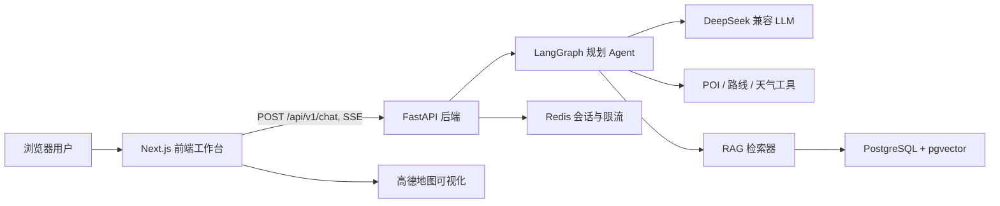
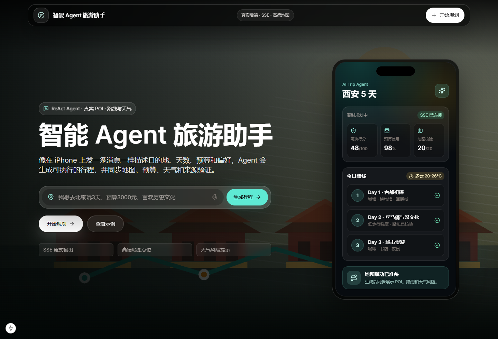
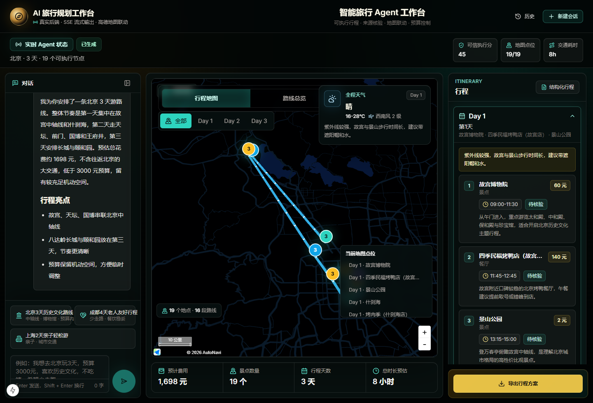
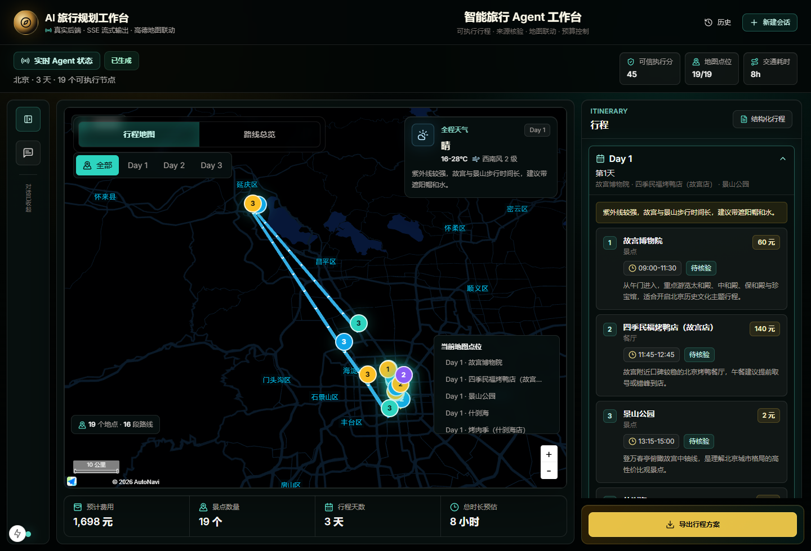

# AI Trip Agent

语言：简体中文 | [English](README.en.md)

AI Trip Agent 是一个面向自由行场景的全栈智能旅行规划助手。用户只需要用自然语言描述目的地、天数、预算、同行人和偏好，系统就可以将需求标准化为结构化旅行意图，调用 Agent 规划流程生成可执行行程，并通过 SSE 将推理过程、来源依据、行程卡片和地图路线实时展示到浏览器。

这个仓库是面向作品集和简历展示整理后的工程版本。毕业论文、答辩材料、生成产物、本地依赖和私有环境文件不会进入仓库。

## 项目亮点

- 自然语言旅行需求识别：支持预算、人数、天数、目的地、偏好等字段抽取和标准化。
- LLM 意图理解主路径：用户输入如 `预算1万元`、`一千块`、`我和父母` 可以被规范化为后端标准字段。
- LangGraph Agent 规划流：包含意图抽取、缺字段追问、工具调用、行程生成和兜底策略。
- SSE 流式输出：前端实时展示 Agent 推理状态、工具调用结果和最终行程。
- RAG 本地知识库：使用 PostgreSQL + pgvector 存储城市 POI、餐饮、住宿、规则和旅行提示。
- POI、路线、天气工具适配：行程节点带来源、坐标、交通耗时、预算和天气风险。
- Redis 会话管理：支持历史会话、上下文保存和按 session 限流。
- Next.js 工作台：包含聊天面板、行程卡片、预算摘要、来源质量检查、导出和地图可视化。
- Docker Compose 本地运行：一套命令启动前端、后端、PostgreSQL 和 Redis。
- 工程化校验：包含 Ruff、mypy、pytest、Playwright、Next build 和 GitHub Actions。

## 技术栈

| 层级 | 技术 |
| --- | --- |
| 前端 | Next.js 15, React 19, TypeScript, Tailwind CSS, Radix UI, Zustand, AMap JS API |
| 后端 | FastAPI, LangGraph, LangChain Core, Pydantic Settings, SQLAlchemy, asyncpg |
| 数据 | PostgreSQL 16, pgvector, Redis 7, 本地 JSON 知识库种子数据 |
| AI 与工具 | DeepSeek 兼容 OpenAI API, sentence-transformers, POI/路线/天气工具模块 |
| 工程化 | uv, pnpm, Ruff, mypy, pytest, Playwright, Docker Compose, GitHub Actions |

## 系统架构



更详细的设计见 [Docs/ARCHITECTURE.md](Docs/ARCHITECTURE.md)。

## 截图

截图由本地真实应用生成，位于 `Docs/images/`。







## 文档目录

- [产品需求](Docs/PRODUCT_REQUIREMENTS.md)
- [技术栈说明](Docs/TECH_STACK.md)
- [架构设计](Docs/ARCHITECTURE.md)
- [API 文档](Docs/API.md)
- [前端设计](Docs/FRONTEND_DESIGN.md)
- [开发指南](Docs/DEVELOPMENT.md)
- [测试指南](Docs/TESTING.md)
- [部署说明](Docs/DEPLOYMENT.md)
- [项目总结](Docs/PROJECT_SUMMARY.md)

## 项目结构

```text
backend/            FastAPI 服务、Agent 图、工具、RAG、测试
frontend/           Next.js 应用、UI 组件、hooks、E2E 测试
Docs/               工程文档与展示截图
.github/workflows/  GitHub Actions CI
scripts/            本地启动脚本
docker-compose.yml  本地全栈运行环境
.env.example        环境变量模板，可安全提交
```

## 环境变量

本地开发前先复制模板。真实密钥必须放在被 Git 忽略的 `.env` 文件里。

```powershell
Copy-Item .env.example .env
Copy-Item .env.example backend/.env
Copy-Item .env.example frontend/.env.local
```

重要变量：

| 变量 | 使用位置 | 说明 |
| --- | --- | --- |
| `DEEPSEEK_API_KEY` | 后端 | LLM API Key。如果曾经提交或分享过，需要立即轮换。 |
| `DEEPSEEK_BASE_URL` | 后端 | OpenAI 兼容接口地址。 |
| `DEEPSEEK_MODEL` | 后端 | 聊天模型名称。 |
| `POSTGRES_*` | 后端、Docker | PostgreSQL 连接配置。 |
| `POSTGRES_HOST_PORT` | Docker | PostgreSQL 暴露到宿主机的端口，默认 `15432`，避免与本机服务冲突。 |
| `REDIS_HOST`, `REDIS_PORT` | 后端、Docker | Redis 连接配置。 |
| `REDIS_HOST_PORT` | Docker | Redis 暴露到宿主机的端口，默认 `16379`。 |
| `AMAP_API_KEY` | 后端 | 高德 REST API Key，用于后端工具。 |
| `NEXT_PUBLIC_AMAP_KEY` | 前端 | 高德 JS API 浏览器 Key，会暴露在浏览器中，需要在高德控制台限制域名。 |
| `NEXT_PUBLIC_AMAP_SECRET` | 前端 | 高德 JS 安全密钥，按部署环境配置。 |
| `NEXT_PUBLIC_USE_MOCK` | 前端 | 是否使用前端本地 mock SSE 响应。 |
| `DEMO_MODE` | 后端 | 是否启用确定性演示兜底行程。 |

## 快速演示

作品集或面试展示时，建议先使用确定性 Demo 模式。它不依赖外部 LLM 是否稳定，但仍会完整走后端、SSE 流、会话持久化、行程解析和前端渲染链路。

```powershell
docker compose up -d postgres redis

cd backend
$env:POSTGRES_HOST = "localhost"
$env:POSTGRES_PORT = "15432"
$env:REDIS_HOST = "localhost"
$env:REDIS_PORT = "16379"
$env:DEMO_MODE = "true"
$env:DEMO_FALLBACK_ENABLED = "true"
$env:PRELOAD_EMBEDDING_MODEL = "false"
uv run uvicorn app.main:app --host 127.0.0.1 --port 8000 --reload
```

第二个终端启动前端：

```powershell
cd frontend
$env:NEXT_PUBLIC_API_URL = "http://127.0.0.1:8000"
$env:API_INTERNAL_URL = "http://127.0.0.1:8000"
corepack pnpm dev
```

打开 [http://localhost:3000/chat](http://localhost:3000/chat)，输入：

```text
我和父母去北京玩3天，预算1万元，喜欢历史文化
```

预期结果：后端会流式返回规划事件，识别并标准化旅行需求，然后生成一份可执行的北京行程。如果没有配置真实 LLM Key，`DEMO_MODE=true` 会使用稳定的确定性兜底行程，保证公开演示可用。

## 本地开发

启动基础设施：

```powershell
docker compose up -d postgres redis
```

默认情况下，Docker 会把 PostgreSQL 暴露到 `localhost:15432`，把 Redis 暴露到 `localhost:16379`。后端容器内部仍然通过 Compose 网络访问 `postgres:5432` 和 `redis:6379`。

启动后端：

```powershell
cd backend
uv sync
uv run uvicorn app.main:app --host 127.0.0.1 --port 8000 --reload
```

如果后端运行在 Docker 外部，并复用 Compose 启动的基础设施，请设置 `POSTGRES_PORT=15432` 和 `REDIS_PORT=16379`。

启动前端：

```powershell
cd frontend
corepack enable
corepack pnpm install --frozen-lockfile
corepack pnpm dev
```

访问 [http://localhost:3000/chat](http://localhost:3000/chat)。

Windows 下也可以使用辅助脚本启动 PostgreSQL、Redis、后端和前端：

```powershell
.\scripts\start-dev.ps1
```

辅助脚本默认使用 `http://127.0.0.1:10808` 作为模型下载代理，并将 `token-plan-cn.xiaomimimo.com` 放入 `NO_PROXY`，使 LLM 服务直连。只有在本机完全不需要代理时才使用 `-NoProxy`。

## Demo Mode

`DEMO_MODE=true` 用于公开演示、面试展示和离线评审。当外部 LLM、地图、天气或 POI 服务不可用时，它可以保持用户可见流程稳定。后端仍会执行结构化需求校验、SSE 输出、Redis 会话存储，并返回完整的行程结构供前端正常渲染。

接近生产的真实模式：

```powershell
$env:DEMO_MODE = "false"
$env:DEEPSEEK_API_KEY = "<your-key>"
$env:AMAP_API_KEY = "<your-key>"
```

只测试前端时可启用 mock 模式：

```powershell
cd frontend
$env:NEXT_PUBLIC_USE_MOCK = "true"
corepack pnpm dev
```

## Docker

运行完整栈：

```powershell
docker compose up --build
```

校验 Compose 配置：

```powershell
docker compose config
```

服务就绪后导入本地知识库：

```powershell
docker compose exec backend uv run python -m app.rag.ingest
```

## 测试与检查

后端：

```powershell
cd backend
uv run ruff check app tests
uv run ruff format --check app tests
uv run mypy app --ignore-missing-imports
uv run pytest tests -q
```

前端：

```powershell
cd frontend
corepack pnpm lint
corepack pnpm typecheck
corepack pnpm build
corepack pnpm test:e2e
```

## 编码说明

所有源码和文档均使用 UTF-8。仓库包含 `.editorconfig` 和 `.gitattributes`，用于约束编辑器和 Git 保持中文 UI 文案可读。在 Windows PowerShell 5 中手动查看中文文件时，建议使用：

```powershell
Get-Content -Encoding UTF8 <file>
```

## 简历展示建议

这个项目适合作为“AI Agent + RAG + 全栈工程化”的简历项目展示。推荐突出以下能力点：

- 将自然语言需求标准化为结构化旅行意图。
- 使用 LangGraph 管理多步骤 Agent 规划流程。
- 将 LLM、RAG、工具调用和传统后端校验结合，避免完全依赖模型输出。
- 使用 SSE 实现实时推理过程展示。
- 使用 pgvector、Redis、Docker Compose 和 CI 形成完整工程闭环。
- 前端不仅展示聊天结果，还提供地图、预算、风险、来源和导出等可执行信息。

## 后续计划

- 增加生产环境部署 profile。
- 加强 Agent 工具调用和外部 API 慢请求观测。
- 增加更多基于 fixture 的行程校验和地图数据测试。
- 如果行程变成用户级持久数据，可增加认证与权限控制。
